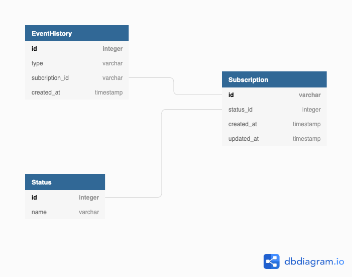

# Tecnologias utilizadas

- **[Spring Boot](https://spring.io/projects/spring-boot)**
- **[Spring Data JPA](https://spring.io/projects/spring-data-jpa#overview)** 
- **[Hibernate](https://hibernate.org/orm/)**
- **[Lombok](https://projectlombok.org/)**
- **[Docker](https://www.docker.com/)**
- **[PostgreSQL](https://www.postgresql.org/)**

# Arquitetura
## Geral


## Banco de dados


## RabbitMQ
- fila **subscription-purchased**: recebe mensagens de assinaturas realizadas.
- fila **subscription-canceled**: recebe mensagens de assinaturas canceladas.
- fila **subscription-restarted**: recebe mensagens de assinaturas reiniciadas.
- fila **x-dead-letter-queue**: recebe mensagens que não foram reconhecidas pelas filas especificadas de assinaturas, seja por erro ou qualquer outro fator. **DLQ implementado**.


# Requisitos para executar o projeto
- [Git](https://git-scm.com/)
- [Docker](https://www.docker.com/)
- [JDK 11+](https://www.oracle.com/br/java/technologies/javase/jdk11-archive-downloads.html)
- [Python](https://www.python.org/downloads/)

# Como executar o projeto
Clone o projeto.
```bash
  git clone https://github.com/SelecaoGlobocom/luis-carlos.git
```
Abra um terminal na raiz do projeto e execute o comando abaixo para iniciar o banco de dados e o RabbitMQ no docker.
```bash
  docker-compose up -d
```

Navegue para a pasta que contém o microserviço que produz as notificações.
```bash
  cd jar && java -jar .\microservice-subscription-producer.jar
```

Abra um novo terminal na raiz do projeto e navegue para a pasta que contém o microserviço que recebe as notificações.
```bash
  cd jar && java -jar .\microservice-subscription-consumer.jar
```

Abra um novo terminal na raiz do projeto e execute o script que importa as notificações do arquivo TXT
```bash
  python import_notificacoes.py
```


## Rotas
Producer Controller
| Method  | Path  | Description  |
| ------------ | ------------ | ------------ |
| POST  |  /api/v1/notify | Executa uma notificação de assinatura |

## Acessar broker RabbitMQ
- Acessar pelo navegador http://localhost:15672/ com as credenciais de usuário e senha: guest

### Futuras features
- Testes unitários/funcionais.
- Swagger no Producer.
- Spring Secutiry para adicionar autenticação da rota no producer.
- Database migration com Flyway.
- Adicionar pré-handle no controller para retornar uma mensagem de erro amigável para o usuário se o campo "notification_type" não for preenchido com possíveis opções do Enum.
- Automatizar o erro proposital no consumer lançando um Throw condicional através de uma variável de ambiente booleana para exibir as mensagens não reconhecidas pelo listener no consumer e caindo na fila DLQ do RabbitMQ.
